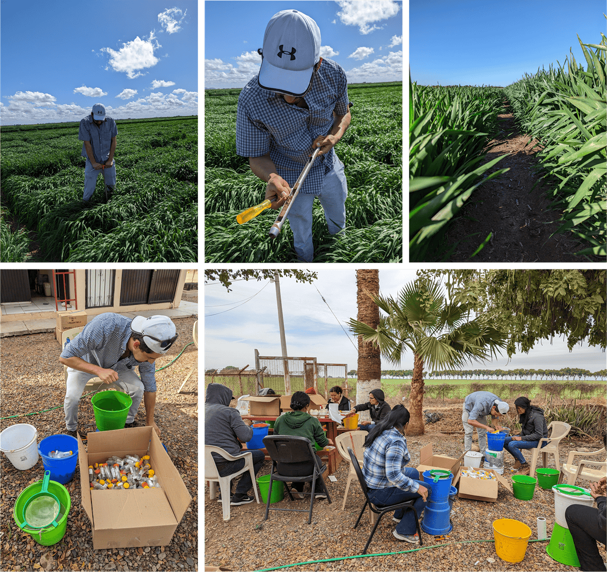
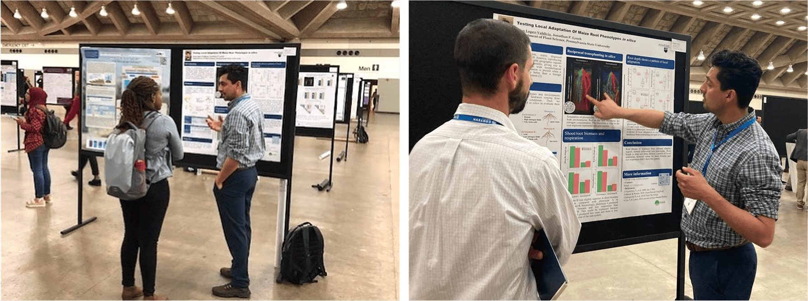

<head>
<!-- Google tag (gtag.js) -->

</head> 

### I'm a Mexican Ph.D. student devoted to understanding the physiological and morphological root adaptations along the domestication and dispersion of maize and wheat. I use greenhouse, field, and modeling approaches to study the role of root anatomy, architecture, and physiology in the adaptation to abiotic stress.

### I'm doing my doctoral thesis under the mentorship of [Jonathan Lynch](https://plantscience.psu.edu/directory/jpl4) at Pennsylvania State University where we implement high-throughput phenotyping of root systems to capture the variation of root phenes (most elemental components of the phenotype), their interactions, and functions under abiotic stress. 

### Last year I shared advances of my project related with the local adaptation of root traits to arid and humid soils at the [ASA, CSSA & SSSA Annual Meeting](https://www.acsmeetings.org/) in Baltimore. 

### Before coming to Penn State University I studied a master degree in Plant Biotechnology at [LANGEBIO Cinvestav](https://langebio.cinvestav.mx/) where I characterized the root anatomy and architecture of 5000-year-old maize specimens coming from the San Marcos cave at Tehuacan Valley. I performed this research at [Paleogenomics Lab](https://langebio.cinvestav.mx/Dr-Rafael-Montiel) and [Apomixis Lab](https://langebio.cinvestav.mx/Dr-Jean-Philippe-Vielle.html) at LANGEBIO, and in collaboration with the [Roots Lab](https://plantscience.psu.edu/research/labs/roots) at Penn State University. We found [evidences](https://www.pnas.org/doi/10.1073/pnas.2110245119) that the root traits were domesticated gradually in maize. Further information can be found [here](https://www.psu.edu/news/research/story/getting-root-corn-domestication-knowledge-may-help-plant-breeders/). I was so fortunate to share my master thesis work at ["Sexto Congreso Internacional El patrimonio Cultural y las nuevas tecnologias"](https://www.youtube.com/embed/EHGk6d-GebA) where I talked in detail about how root traits were affected gradually during the domestication of maize.

