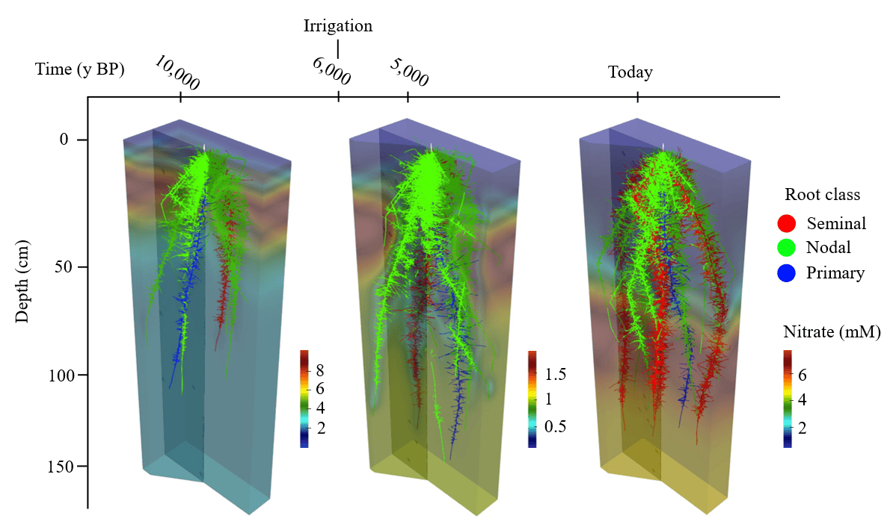

<head>
<!-- Google tag (gtag.js) -->

</head> 

# Welcome! v7

##
### Hi there! Thank you for visiting my website! 

### My name is Ivan Lopez Valdivia, and I'm a postdoctoral researcher at the [Leibniz Institute of Plant Genetics and Crop Plant Research](https://www.ipk-gatersleben.de/en/), working with [Prof. Hannah Schneider](https://scholar.google.de/citations?user=_lMz9nYAAAAJ&hl=en) in the [Genetics and Physiology of Root Development laboratory](https://www.ipk-gatersleben.de/en/research/physiology-and-cell-biology/genetics-and-physiology-of-root-development). 

### My research focuses on understanding how root systems adapt to diverse soil conditions and how crop domestication has shaped these adaptations. I'm particularly interested in:

###
*	### **Key Root Traits for Improved Crop Performance:** I'm particularly interested in explroring the phenotypic variation of maize landraces and understanding the roles of cortical cell size, cortical cell file number, root cortical aerenchyma, and lateral root branching density in enhancing resource acquisition, especially under stress conditions like low phosphorus and low nitrogen availability.

## 
*	### **Functional-Structural Plant Modeling:** I employ advanced modeling tools such as [OpenSimRoot](https://www.fz-juelich.de/en/ibg/ibg-2/expertise/technology-process-development/opensimroot) to simulate plant growth in response to environmental factors such as nutrient availability and water stress. By integrating root phenotypes into these models, I can predict how different root traits contribute to plant performance in various environments.

###
*	### **The Role of Roots in Crop Domestication:** My work delves into the evolutionary history of crop root systems, with a focus on maize. By combining ancient DNA analysis, paleobotanical data, and functional-structural modeling, I investigate how domestication has altered root traits and their impact on crop adaptation to changing agricultural practices.

##
## Publications - [ORCID](https://orcid.org/0000-0003-1955-4989)/[Google Scholar](https://scholar.google.com/citations?hl=es&user=XMdjIEsAAAAJ&view_op=list_works&gmla=AJsN-F6isZkiyjPpbsJBrlo_uGiqM4QcqputVuSh1_UxWGu-cffGUq_q7upHdrAUoy6T32ajtAO8NPw6FlwkvcrSEKIASgpEhg)
### 2024

* **Ivan Lopez-Valdivia**, Miguel Vallebueno-Estrada, Harini Rangarajan, Kelly Swarts, Bruce F. Benz, Michael Blake, [Jagdeep Singh Sidhu](https://jagdeepideas.com/), Sergio Perez-Limon, Ruairidh J. H. Sawers, Hannah Schneider, Jonathan P. Lynch. In silico analysis of the evolution of root phenotypes during maize domestication in Neolithic soils of Tehuacán, biorxiv [Full Record](https://www.biorxiv.org/content/10.1101/2024.11.18.623787v2)

* **Ivan Lopez-Valdivia**, Harini Rangarajan, Miguel Vallebueno-Estrada, Jonathan P. Lynch Exploring yield stability and the fitness landscape of maize landrace root phenotypes in silico. biorxiv  [Full Record](https://www.biorxiv.org/content/10.1101/2024.09.07.609951v1)

* [Jagdeep Singh Sidhu](https://jagdeepideas.com/), **Ivan Lopez-Valdivia**,  Christopher F Strock, Hannah M Schneider, Jonathan Lynch. 2024. Cortical parenchyma wall width regulates root metabolic cost and maize performance under suboptimal water availability. Journal of Experimental Botany [Full Record](https://academic.oup.com/jxb/article/75/18/5750/7658190)

### 2023

* **Ivan Lopez-Valdivia**; Xiyu Yang; Jonathan P. Lynch. 2023. Large root cortical cells and reduced cortical cell files improve growth under suboptimal nitrogen in silico. Plant Physiology,  [Full Record](https://academic.oup.com/plphys/advance-article/doi/10.1093/plphys/kiad214/7114972?login=true)

* Miguel Vallebueno-Estrada; Guillermo G. Hernández-Robles; Eduardo González-Orozco; **Ivan Lopez-Valdivia**; Teresa Rosales Tham; Víctor Vásquez Sánchez; Kelly Swarts; Tom D. Dillehay; Jean-Philippe Vielle-Calzada; Rafael Montiel. 2023. Domestication and lowland adaptation of coastal preceramic maize from Paredones, Peru. eLife, [Full Record](https://elifesciences.org/articles/83149)

### 2022

* **Lopez-Valdivia Ivan**, Alden Perkins, Hannah Schneider, Miguel Vallebueno-Estrada, James Burridge, Eduardo González-Orozco, Aurora Montufar, Rafael Montiel, Jonathan Lynch, Jean-Philippe Vielle-Calzada. 2022. Gradual domestication of root traits in the earliest maize from Tehuacan. PNAS Vol. 119 No. 17 e2110245119 [Full Record](https://www.pnas.org/doi/epdf/10.1073/pnas.2110245119)

### 2019

* **Lopez-Valdivia Ivan** (2019) Caracterización de raíces milenarias de maíz provenientes de Tehuacán: comparación con poblaciones actuales del género Zea. CINVESTAV. Mexico. Tesis de Maestria. [Full Record](LopezValdivia_master.pdf)

## About me

### I'm a Mexican Ph.D. devoted to understanding the physiological and morphological root adaptations along the domestication and dispersion of maize and wheat. I use greenhouse, field, and modeling approaches to study the role of root anatomy, architecture, and physiology in the adaptation to abiotic stress.

### I finished my PhD in 2024 under the mentorship of [Jonathan Lynch](https://plantscience.psu.edu/directory/jpl4) at Pennsylvania State University where we implemented high-throughput phenotyping of root systems to capture the variation of root phenotypes and their interactions, and functions under abiotic stress. 

### In 2022, I shared advances of my project related with the local adaptation of root traits to arid and humid soils at the [ASA, CSSA & SSSA Annual Meeting](https://www.acsmeetings.org/) in Baltimore. 

### Before going to Penn State University I studied a master degree in Plant Biotechnology at [LANGEBIO Cinvestav](https://langebio.cinvestav.mx/) where I characterized the root anatomy and architecture of 5000-year-old maize specimens coming from the San Marcos cave at Tehuacan Valley. I performed this research at [Paleogenomics Lab](https://langebio.cinvestav.mx/Dr-Rafael-Montiel) and [Apomixis Lab](https://langebio.cinvestav.mx/Dr-Jean-Philippe-Vielle.html) at LANGEBIO, and in collaboration with the [Roots Lab](https://plantscience.psu.edu/research/labs/roots) at Penn State University. We found [evidences](https://www.pnas.org/doi/epdf/10.1073/pnas.2110245119) that the root traits were domesticated gradually in maize. Further information can be found [here](https://www.psu.edu/news/research/story/getting-root-corn-domestication-knowledge-may-help-plant-breeders/). I was so fortunate to share my master thesis work at ["Sexto Congreso Internacional El patrimonio Cultural y las nuevas tecnologias"](https://www.youtube.com/embed/EHGk6d-GebA) where I talked in detail about how root traits were affected gradually during the domestication of maize.

##
##
## Contact me 
<!-- modify this form HTML and place wherever you want your form -->
<form
  action="https://formspree.io/f/xzzzdaaz"
  method="POST">
  <label>
    Name:
    <input type="name" name="name">
  </label>  
  <label>
    Email:
    <input type="email" name="email">
  </label>  
  <label>
    Message:
    <textarea name="message"></textarea>
  </label>  
  <!-- your other form fields go here -->
  <button type="submit">Send</button>
</form>

##
##
##
##
#### _"La gente, hecha de maíz, hace el maíz._
#### _La gente, creada de la carne y los colores del maíz,_
#### _cava una cuna para el maíz, y lo cubre de buena_
#### _tierra y lo limpia de malas hierbas y lo riega y le_
#### _habla palabras que lo quieren._
#### _Y cuando el maíz esta crecido, la gente de maíz lo_
#### _muele sobre la piedra y lo alza y lo aplaude, y lo_
#### _acuesta al amor del fuego y se le come, para que en_
#### _la gente de maíz siga el maíz caminando sin morir_
#### _sobre la tierra"_
# 
#### Eduardo Galeano

