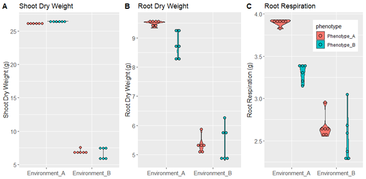
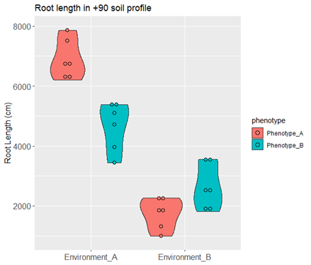

# __Chapter 1 - Cortical Cell Size and Cortical Cell File Number__ 
## Introduction

## Results
### Figure 1

### Figure 2

### Figure 3

### Figure 4

## Discussion
## Conclusion

# __Chapter 2 - Local adaptation of root traits__
## Introduction
### _Origin of Maize_
Maize originated in Mexico from teosinte around 9000 years ago (Matsouka, 2002). During its domestication, maize dispersed throughout North and South America, growing and adapting in a highly variable geographic regions with specific edaphic constraints, giving rise to multiple populations with wide genetic and morphological diversity (Vigouroux, 2008). The root system is the organ in charge to respond and adapt to any stress condition in the soil, however the role of roots traits during maize dispersion and domestication have been neglected. In 2013, Burton et al., studied the root diversity of maize analyzing architectural and anatomical root traits in populations of 195 landraces and 61 teosintes from America. The mainly contribution was that maize tend to have more seminal roots and less crown roots compared with teosinte (Burton, 2013). However, the possibility that this root phenotypic variation show local adaptation to their original environment has not been explored. 

### _Maize roots and domestication_
Root architecture is a determinant factor to adapt to edaphic stress because it determines the spatial distribution of a root system in the soil. Since plants need to uptake mobile and immobile nutrients the spatial location of the roots will determine it success to capture nutrients. For example, it has been tested that maize varieties with higher number of crown roots tend to develop shallow angles and distribute its root system in the shallow parts of the soils compared with varieties with lower number of crown roots. Under phosphorus stress varieties with higher number of crown roots perform better due to the phosphorus is an immobile nutrient that accumulates in the shallow profiles of the soil (Sun, 2018). In contrast, maize lines with low number of crown roots develop steeper angles, allowing the roots explore the deeper profiles of the soils. Under low nitrogen and water stress maize varieties with less crown roots perform better because they are able to reach the nitrogen and water that leach to the deeper soil profiles (Gao 2016; Saengwilai 2014a). 

### _Cheap roots for soil adaptation_
The ability to reduce the metabolic cost of soil exploration is also an important factor to adapt in poor soil conditions and it is directly related with some phenotypic traits. For example, reducing the number of crown roots will also reduce the respiration cost of the root system, therefore varieties of maize with less crown root number will have steeper angles but also less carbon requirements for respiration. The carbon saved from respiration then could be used for growth instead (Saengwilai 2014a). Other traits that reduce the metabolic cost is the programed cell death in the cortex of the roots, called aerenchyma. This trait makes air spaces in the cortex that is useful to adapt to very humid conditions, but also to reduce the metabolic cost since there are less cells respiring. Maize varieties with and without aerenchyma were evaluated under low nitrogen conditions and the ones with aerenchyma were superior to adapt in these conditions (Saengwilai 2014b).

### _OpenSimRoot as a tool to study domestication of roots._
These relations between root traits and nutrient capture efficiency have been used to create OpenSimRoot, which is a structure-function model that simulates root growth considering the root architecture, cost of soil exploration and maintenance. OpenSimRoot has been useful to predict the impact of root traits like number of seminal roots, number of crown roots and aerenchyma volume in plant growth (York et al., 2015, Saengwilai, 2014a; Postma. et al., 2011; Saengwilai, 2014b). However, the model has been not used before to test if root phenotypes have local adaptation. In this work, we used OpenSimRoot to design artificial environments for high and low nitrogen fields and test if the maize root phenotypes of landraces that evolved in those environments showed local adaptation.  

## Hypothesis 
Maize landraces coming from low nitrogen fields have root phenotypes that are more efficient to uptake nitrogen in silico compared with landraces coming from high nitrogen fields.

## Methods 
### _Model description_
[OpenSimRoot](https://rootmodels.gitlab.io/) (OSR) is a structural-functional model that simulates root growth and interaction with soil in three dimensions. To simulate root geometry the model assumes the hypocotyl as the starting point and roots develop from it considering axial and radial branching (Lynch 1997). Root growth in three dimensions is represented with static and dynamic coordinates that store the information of the previous location (Postma, 2017). The root architecture and hierarchical development will depend on the specie. Actually, OSR is able to simulate root systems of barley, bean, maize, squash and Arabidopsis (Shafer, 2019). Taking maize as example, the first root that develop is the primary root, then seminal roots, nodal roots and brace roots. Each root type develops lateral roots also considering the radial and axial branching (Lynch 1997). Parameters like number of roots, growth rates, branching density, respiration, photosynthesis, leaf expansion rate are measured empirically and are used in the model as input files. 

OSR includes a carbon module, that calculates the available carbon for growth based on a subtraction of the carbon sources minus the carbon sinks. The carbon sinks are the root exudates and the maintenance cost due respiration, while the carbon sources are the carbon available in the seed and the carbon produced by photosynthesis. Some carbon partitioning rules are that exudates and respiration are obligated cost, once this demand is covered the remaining carbon could be used for growth. The carbon for growth is partitioned in shoot and root, giving priority to the shoots.  OSR also includes a nitrogen module that simulates the leaching of water and nutrients in the soil. Movement of water and nitrate is computed by integrating the SWMS_3D model, which numerically solves Richard equation for satured-unsaturated water flow and the convection-dispersion equation for solute transport (Simunek, 1995). 

To simulate stress the model calculates a nutrient stress factor (NEF) based on the optimal nutrient concentration of the tissues. When the nutrient availability in the simulated soil is less than the optimum the NEF will increase. The NEF will directly impact leaf expansion rate and light use efficiency. When leaf expansion rate is reduced, the sink of the shoot is reduced, and carbon is allocated in the roots, functioning as a growth regulator. In other hand, when light use efficiency is affected, there is less carbon and a reduction of growth in general. The impact of NEF in leaf expansion rate and light use efficiency is nutrient specific. For example, when phosphorus concentration is below the optimum it will impact leaf expansion rate. When potassium is below the optimum the NEF will affect light use efficiency, and when nitrogen is below the optimum it will affect both (Postma, 2011).

### _Outputs_
The outputs of the system are “table_output.tab” files, which contains a table with information for shoot dry weight, photosynthesis, respiration, nutrient uptake, stress factor etc. for every time steps. In addition, the model produces VTP/VTU files that contains the locations of every root segments and root properties, as well as soil properties. These files can be visualized using Paraview, in which variables like nutrient concentration in soil and nutrient uptake by roots can be observed trough time. 

### _Genotypes_
We used a root phenotypic diversity panel of 195 landraces and 61 teosintes from America (Burton 2013) to select phenotypes coming from high and low nitrogen fields. We obtained georeferenced information for every genotype using GRIN, USDA data base. Only 99 landraces from Burton panel were present in GRIN with georeferenced information included. We obtained information for total nitrogen in the soils using soilGrids (Sousa 2020) for each line and we selected the landraces coming from low nitrogen fields (.88 g/kg) and high nitrogen fields (5.11 g/kg). Low nitrogen fields belonged to arid category in FAO classification while high nitrogen field belonged to humid or sub-humid regions. Furthermore, the predominant soil of high nitrogen fields was 40% of sand, 30% of silt and 30% of clay, while in the low nitrogen fields it was 55% sand, 30% silt and 15% clay, corresponding to clay-loam and sandy-loam, respectively. We integrated data for nitrogen, climatic region and soil texture to design artificial environments for high and low nitrogen soils, named Environment A and B, respectively (Table 1). Since the root phenotypes from high and low nitrogen fields also showed differences, we designed phenotypes A and B, corresponding to high and low nitrogen fields, respectively (Table 2). 

### _Runs_
We ran six replicates of all the possible combinations of environments and phenotypes: being Environment A-Phenotype A, Environment A-Phenotype B, Environment B-Phenotype A and Environment B-Phenotype B. We used a workstation in Pennsylvania State University with 60 GB RAM memory. Simulations took 96 hours to compute. Output data was analyzed with R and Paraview. 

Table 1. Environment from high (A) and low (B) nitrogen soils.
```{r, echo= FALSE, message=FALSE}
mytbl <- tibble::tribble(
  ~" ", ~"Environment A", ~"Environment B",
  "Soil Texture", "Clay loam", "Sandy loam",
  "Ksat", "59.96 cm/day", "85.31 cm/day",
  "Nitrogen", "83.21 uMol/ml", "4.005uMol/ml",
  "Precipitation", "171.3 mm/40 days","57.1 mm/40days"
  
)

require(rhandsontable)
rhandsontable(mytbl)
```

Table 2. Root phenotypes from high (phenotype A) and low (phenotype B) nitrogen soils.
```{r, echo= FALSE, message=FALSE}
mytbl2 <- tibble::tribble(
  ~"Phenotype", ~"N1", ~"N2",~"N3", ~"N4",~"SRN", ~"TRN",~"A",
  "A", "5", "5","5", "8","4", "27","58",
  "B", "4", "4","5", "7","3", "23","54"
)

require(rhandsontable)
rhandsontable(mytbl2)
```
N#: Number of root per node
SRN: Seminal root number
TRN: Total root number
A: Angle


## Results and Discussion 
During its spread through America, maize landraces have been evolving and adapting to a very diverse soil conditions, including lack of nutrients and water. To test if the root phenotypes of landraces from high and low nitrogen fields showed local adaptation to their original environments, we design artificial phenotypes and environments of these conditions using OpenSimRoot and test their performance in all combinations. High nitrogen soils (environment A) were represented with an artificial soil with 83.21 Mol/ml nitrate concentration, clay-loam soil texture and 171.3 mm of precipitation, while low nitrogen soils (environment B) were represented with an artificial soil with 4.005 Mol/ml nitrogen concentration, sandy-loam soil and 57.1 mm of precipitation (Table 1, Video 1). On the other hand, root phenotypes were designed considering the angle, and number of seminal and nodal roots of genotypes from high and low nitrogen fields. Phenotypes for high nitrogen fields (phenotype A) were characterized for having 1 more nodal root per node and shallower angle compared with phenotypes from low nitrogen fields (phenotype B; Table 2, Video 1).

<iframe width="560" height="315" src="https://www.youtube.com/embed/4hO6eV4Xgdo" title="YouTube video player" frameborder="0" allow="accelerometer; autoplay; clipboard-write; encrypted-media; gyroscope; picture-in-picture" allowfullscreen></iframe>
Video 1. Simulation of phenotypes A and B at day 40 under both environments. Red color in the soil represents the nitrogen concentration. Yellow color in the root segments represent the nitrogen uptake. 

In order to compare the fitness of phenotype A and B under both environments, we analyzed the values for shoot dry weight, root dry weight and root respiration at day 40. We observed that under environment A, the phenotype B was slightly superior on shoot dry weight production compared with phenotype A (Figure 1A). Interestingly, phenotype B produced less root dry weight (Figure 1B) and less respiration (Figure 1C) than phenotype A. This could be explained because phenotype B produced less roots and there is less maintenance cost of the root system. Since maintenance cost represent one of the stronger sinks of carbon, phenotype B is able to save the carbon wasted in maintenance and invest it in growth, therefore producing greater shoot dry weight. In environment B the variation of values for shoot dry weight, root dry weight and root respiration are more variable compared with environment A (Figure !), that could be associated with the stochasticity of the model, which tend to be more significant when the plant is under stress. 


To further investigate the patterns of root growth of phenotypes A and B under both environments we looked at the root length in deeper profile of the soil. We observed that under environment A, the phenotype A reached deeper soil profile compared with phenotype B. In contrast, under environment B the phenotype B produced deeper roots compared with phenotype A (Figure 2). This is interesting because root depth has been pointed as an important trait to adapt to low nitrogen (Saengwilai, 2014a) and water conditions (Gao, 2016). If we assume that deeper roots is a trait associated with fitness we might have clear evidence of local adaptation in root phenotypes of landraces from contrasting nitrogen level fields. We also shall consider that the soil texture of low nitrogen fields was sandy-loam, which have higher hydraulic conductivity compared with the clay-loam (Table 1). It is possible that we are not simulating correctly the leaching of the nitrogen in the soil. For example, environment B have higher hydraulic conductivity, however the reduced precipitation slows the leaching. One of the weakness of this model is that it only simulates growth for 40 days, but if we consider leaching in several seasons maybe the nitrogen would remain stocked in the deeper soils and deeper root would be more important trait for nutrient acquisition and growth. 



The overall results of these project show that no pattern of local adaptation was obtained in any of the variables analyzed above, with exception of root length in deep profiles, however we cannot discard local adaptation in these genotypes, since there are intrinsic variables like phenotypic plasticity and soils dynamics that we are not considering in the simulations.

## Conclusion
Root length in the deeper soil profiles showed a pattern of local adaptation, however values for shoot dry weight, root dry weight and root respiration didn’t show this pattern. It is necessary to consider nutrient leaching across more than 40 days to represent correctly the high and low nitrogen environments. 

# __Chapter 3 - Domestication effect on MCS__
## Introduction
### Topic 1
### Topic 2
### Topic 3
## Objective
## Results
### Figure 1
### Figure 2
### Figure 3
### Figure 4
## Discussion
## Conclusion
