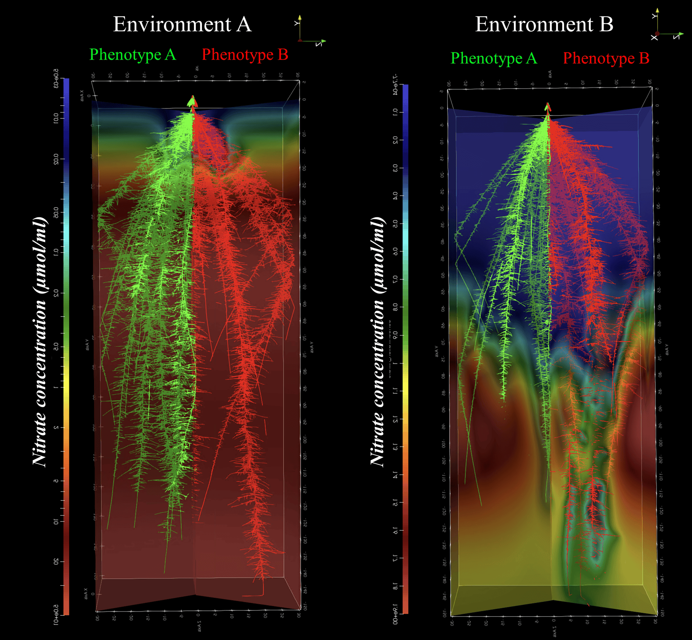

<head>
<!-- Google tag (gtag.js) -->

</head> 

# __Root cortical anatomy and nitrogen capture__

We are exploring how certain anatomical traits reduce root construction and maintenance cost. This reduction in cost improves root growth and uptake of nitrogen. For instance, in the video, we show the simulated root architecture of two genotypes with contrasting cortical cell file number (CCFN); reduced CCFN (green), and increased CCFN (red) under moderate N stress.

<iframe width="560" height="315" src="https://www.youtube.com/embed/Kvpb8mneHgs" title="YouTube video player" frameborder="0" allow="accelerometer; autoplay; clipboard-write; encrypted-media; gyroscope; picture-in-picture; web-share" allowfullscreen></iframe>

Reduced CCFN decreased metabolic cost, improving root growth, allowing the root system to grow deeper and capturing the nitrogen that is leaching. The continuous gradient from red to blue in the simulated soil represents nitrogen depletion by root uptake and leaching. We simulated the root systems with [OpenSimRoot](https://rootmodels.gitlab.io/) (OSR), a structural-functional model that simulates root growth and interaction with soil in three dimensions.

# __Domestication of root traits in the earliest maize__

We are also exploring the effect of domestication in root traits. We used laser ablation tomography to characterize the root anatomy of [5,300-y-old maize](https://www.pnas.org/doi/full/10.1073/pnas.1609701113) specimens recovered from San Marcos (Tehuacán, Mexico), revealing exquisite preservation of their cellular organization. 

<iframe width="560" height="315" src="https://www.youtube.com/embed/XZTEIv52eaw" title="YouTube video player" frameborder="0" allow="accelerometer; autoplay; clipboard-write; encrypted-media; gyroscope; picture-in-picture; web-share" allowfullscreen></iframe>

We observed the [presence](https://www.pnas.org/doi/epdf/10.1073/pnas.2110245119) of Multiseriate Cortical Sclerenchyma (MCS), a root anatomical phenotype recently discovered by [Hannah Schneider et al.](https://www.pnas.org/doi/10.1073/pnas.2012087118). MCS increases the tensile strength of the root and was associated with improved penetration of hard soils. This trait is absent in teosintes. The presence of MCS 5000 years ago suggest an early fixation during domestication, however its role during the the establishment of Mesoamerican agriculture is still unknown. We are using simulations to understand the effect of MCS in early stages of agriculture in Mesoamerica. 

# __Local adaptation of root traits__

Also, we are investigating the root adaptations of local varieties from humid (Environment A) and arid (Environment B)  regions across Latinamerica. We designed root phenotypes and environments corresponding to maize landraces coming from contrasting edaphic conditions. Then we reciprocally transplanted in silico to evaluate their performance.

### Reciprocal Transplanting In silico - Envinronment A

<iframe width="560" height="315" src="https://www.youtube.com/embed/woIibJjGRpo" title="YouTube video player" frameborder="0" allow="accelerometer; autoplay; clipboard-write; encrypted-media; gyroscope; picture-in-picture; web-share" allowfullscreen></iframe>

### Reciprocal Transplanting In silico - Envinronment B

<iframe width="560" height="315" src="https://www.youtube.com/embed/toQBu0TGq3E" title="YouTube video player" frameborder="0" allow="accelerometer; autoplay; clipboard-write; encrypted-media; gyroscope; picture-in-picture; web-share" allowfullscreen></iframe>

**Keep tuned for our following results!**

