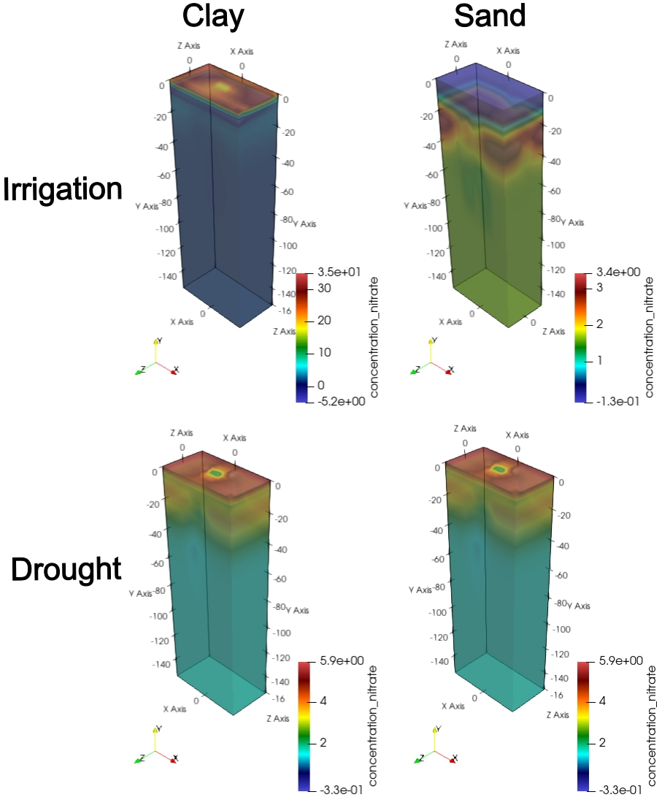

<head>
<!-- Google tag (gtag.js) -->
<script async src="https://www.googletagmanager.com/gtag/js?id=G-ERV5WXQZ44"></script>
<script>
  window.dataLayer = window.dataLayer || [];
  function gtag(){dataLayer.push(arguments);}
  gtag('js', new Date());

  gtag('config', 'G-ERV5WXQZ44');
</script>
</head> 

##

***


***


# __Introduction__

### Hi there! Welcome to the OpenSimRoot workshop! 

### In this workshop, you will learn the basics of the structural-functional model for simulating root growth using OpenSimRoot. This course will be divided into several sections that will guide you from the basics of OpenSimRoot for users to the more complex engine code for developers.

### In __Section 1__, you will learn what programs you need for running a simple simulation, how to extract your data, and how to see the 3D models of your roots.

### In __Section 2__, you will learn about root phenotypes and how to modify parameters such as root number, angle, lateral branching frequency, growth rates, etc.

### In __Section 3__, you will learn about soil parameters, including soil texture and hydraulic parameters, bulk density, and nutrient availability.

### In __Section 4__, you will learn about atmospheric parameters such as temperature, precipitation, wind speed, humidity, etc.

### In __Section 5__, you will have a specific case study of how to implement OpenSimRoot for a real scientific problem.


### Before you jump into the sections, please download the following __programs__:

*  ### [OpenSimRoot and InputFiles](https://drive.google.com/drive/folders/12LtlyuJ_TFM_pVE7Z4nMPTQpxeeCpz0h?usp=sharing)
*  ### [R and Rsudio (you will need to download both!)](https://posit.co/download/rstudio-desktop/)
*  ### [Paraview](https://www.paraview.org/)
*  ### [Putty](https://www.chiark.greenend.org.uk/~sgtatham/putty/latest.html)
*  ### [WSL](https://learn.microsoft.com/en-us/windows/wsl/install) 

### If you have any trouble downloading the programs or if you are a Mac user, please [send me a message](https://ilovaldivia.github.io/Lopez-Valdivia/contact.html).

***

# __Section 1 - Running a simple simulation in OpenSimRoot__

### Here you will run your first simulation! There are a few steps you need to perform before running the simulation. Once you have downloaded the OpenSimRoot source code and the inputfiles, you need to compile the program OpenSimRoot in your computer or cluster. For this, access to your OpenSimRoot source code using WSL into OpenSimRoot-master and run the program build.sh using the command: 

> `bash build.sh`

### If you got an error in the compilation, double check that you have the most recent version of your compilator is loaded. You can run the command: 

> `module load gcc/your_latest_version` 

### If want to know the versions available in your computer, run this command:  

> `module avail`

### Once you succesfully compiled you OpenSimRoot you are ready to run the first simulation! 

### If you are using WSL in your own computer, run the command:

> `./pathToDownload/OpenSimRoot_Linux_x64 -f ./pathToUnzippedArchive/`

### If you are using a slurm cluster, run the program __"input_production.sh"__:

> `bash input_production.sh`


### and then __"run_rep_v4.sh"__:

> `bash run_rep_v4.sh`


### You can follow this process step-by-step in this [Tutorial 1](https://www.youtube.com/watch?v=oaAmS1WnMO0&t=249s&ab_channel=ivanlopez)
<iframe width="560" height="315" src="https://www.youtube.com/embed/oaAmS1WnMO0?si=KJ7Iqx0OILp-1eFl" title="YouTube video player" frameborder="0" allow="accelerometer; autoplay; clipboard-write; encrypted-media; gyroscope; picture-in-picture; web-share" referrerpolicy="strict-origin-when-cross-origin" allowfullscreen></iframe>

***

## _Results_ 

### OpenSimRoots produces different type of outputs. It produces vtu and vtp files with the 3D representation of the root system and the soil over multiple time steps. It also include a table_output.tab file, which include values of the variables such as shoot dry weight, root dry weight, nitrogen depletion paterns, root distribution and many more. For this example, we show the root distribution in the form of root weight along different soil profiles (0-10 cm, 10-20 cm, and so on).

```{r interactive-plot, message=FALSE, warning=FALSE, echo=FALSE}
# Paso 1: Cargar las librerías necesarias
library(crosstalk)
library(plotly)
library(tidyverse)


results <- read.csv("results_section1.csv") 

### CAMBIO 1: Modificación en SharedData para una mejor compatibilidad con filtros múltiples ###
# Cambiamos "key" por "group" para enlazarlo con el widget de checkboxes.
shared_results <- SharedData$new(results, group = "selector_group")

### CAMBIO 2: Reemplazar el menú desplegable por casillas de verificación (checkboxes) ###
# Usamos filter_checkbox para permitir la selección múltiple.
filter_widget <- filter_checkbox(
  id = "selector_name",
  label = "Chose one or more variables:", # Etiqueta actualizada
  sharedData = shared_results,
  group = ~name,
  inline = TRUE # Muestra las casillas en una línea
)

# Paso 5: Crear la gráfica base con ggplot
### CAMBIO 3: Actualizar la estética (aes) para usar colores por variable ###
# Añadimos "color = name" y "group = name". El texto del tooltip también se actualiza.
p <- ggplot(shared_results, aes(x = time, y = value, color = name, group = name, 
                                text = paste("Name:", name, "<br>Time:", time, "<br>Value:", round(value, 2)))) +
  
  ### CAMBIO 4: Eliminar el color fijo de las geometrías ###
  # Se quita "color = 'steelblue'" para que ggplot use los colores definidos en aes().
  geom_point(size = 3, alpha = 0.8) +
  geom_line(alpha = 0.5) +
  
  ### CAMBIO 5: Añadir título a la leyenda de colores ###
  labs(
    title = "Data visualization",
    x = "Time",
    y = "Value",
    color = "Variable" # Título para la leyenda de colores
  ) +
  theme_minimal()

# Paso 6: Convertir la gráfica de ggplot a una gráfica de plotly
plotly_plot <- ggplotly(p, tooltip = "text")

# Paso 7: Presentar el filtro y la gráfica juntos
### CAMBIO 6: Ajustar la disposición para apilar el filtro sobre la gráfica ###
# Esto suele funcionar mejor visualmente con las casillas de verificación.
bscols(
  filter_widget,
  plotly_plot,
  widths = 12
)

```

***

# __Section 2 - Root phenotypes__

### To define the root architecture in OpenSimRoot it is necesary to edit the parameters for the root system in the inputfiles. For instance, in the InputFiles we can define the number of nodal roots, angle of emergence of the roots, lateral branching frequency, among others. For this workshop, we will use a script called __"input_production.sh"__ which will simplify this process for you. The "input_production.sh" script will edit and create new inputfiles based on the spreadsheet __"parameters_v1.csv"__, in which you will specify the root phenotypes you want. Think about it as a two step process, in which you first define your parameters in the "parameters_v1.csv", then run the script "inputfile_production.sh" and create the input files. Once you have created the inputfiles you can run the simulations. 


### So, let's explore the parameters_v1.csv file. It contains  : 

```{r data-setup, echo = FALSE, warning = FALSE, message = FALSE}
# This code will RUN, but you will not see this block in the HTML file.

# Load the necessary libraries
library(DT)
library(readr) # Use this for .csv files

# Read the spreadsheet from the 'data' folder
# The path is relative to the root of your project
spreadsheet_data <- read_csv("parameters_v1.csv")

# Create the interactive datatable
datatable(
  spreadsheet_data,
  caption = "An interactive preview of the parameters spreadsheet.",
  options = list(
    scrollX = TRUE,
    autoWidth = TRUE,
    columnDefs = list(list(
      targets = "_all",
      className = "dt-nowrap"
    )))
)


```


### From column 1 to 7 we have the Tags. These are not parameters but simple names that you can edit when designing your simulations. For instance, in column 1 we have ACCESSION, which correspond to a particular phenotype, let's say steep or shallow roots. In the column 2 we have the environment, which we will cover in section 3 and 4. In this case, column 2 is the same for all because we are using the same environment for all the simulations. The rest of the columns have 0 because we are not using them in this example, but can be easily edited by the user as needed.

### Starting from column 8 we have the parameters of the simulation. These parameters include parameters for the root morphology, root physiology and environment. In this section we will focus only in the root morphology. In particular we will look at the columns AN_, NRN_, and MIN/MAX_BF, which represents the values for __Angle__, __Number of roots__ and __lateral branching frequency__. You will notice that the column name is accompanied by the acronyms "SEM", "N1", "N2", ... "N7". These acronyms refer to the root type the apply. For instance, AN_N1 correspond to the Angle for nodal root 1, NRN_SEM correspond to the number of "seminal" roots. 

### In the following figure you can see the results for each of the ACCESSIONS, corresponding to contrasting values for Angle, Number of roots and Branching frequecies. 

###


***

# __Section 3 - Soil Environment__

### In this section we will explore the parameters to simulate different soil types. In OpenSimRoot, the soil is represented as a matrix in which different modules simulate: the concentration and movement of nutrients (N, P, K) in different profiles, bulk density, organic matter and soil dimensions. Soil texture is considered by the integration of the van Genuchten parameters for soil hydraulic conductance and water retention. In [SoilGrids](https://soilgrids.org/), you can have access to different soil cores around the world and you can obtain information about the physical and chemical characteristics for a particular soil type. Based on the soil physical properties, you can use the software [Rossetta](https://www.handbook60.org/rosetta/) to obtain the van Genuchten parameters. 

### Once you have obtained all the parameters of your soil you can input them into the models using the "parameters_v1.csv" file that we reviewed before. To change this parameters, refer to the columns: bulk density, Nitrogen (multiplier), Mineralization (multiplier), Organic Matter (multiplier), Residual Water Content, Saturated Water content, Alpha, n, Saturated Conductivity, OM (organic mater), Phoshporus (multiplier). Note that some variables are a "multiplier", which means that the value to set will multiply the actual values of the input file. To see the actual values you can open the runMaize.xml file in the Reference directory. The variables without a "multiplier" label refer to the actual values. 

###  For this example, we obtained the physical and chemical properties from Colorado, USA and Cusco, Peru and simulated a clay and sandy soil, respectively. 



***

# __Section 4 - Atmosphere__

***

# __More information__
* ### [OpenSimRoot wiki](https://gitlab.com/rootmodels/OpenSimRoot/-/wikis/home)
 
* ### Postma JA, Kuppe C, Owen MR, Mellor N, Griffiths M, Bennett MJ, Lynch JP, Watt M. 2017. [OpenSimRoot: widening the scope and application of root architectural models](https://nph.onlinelibrary.wiley.com/doi/10.1111/nph.14641). New Phytologist 215: 1274–1286.

### This workshop is in continuous development, and more sections will be gradually added.


